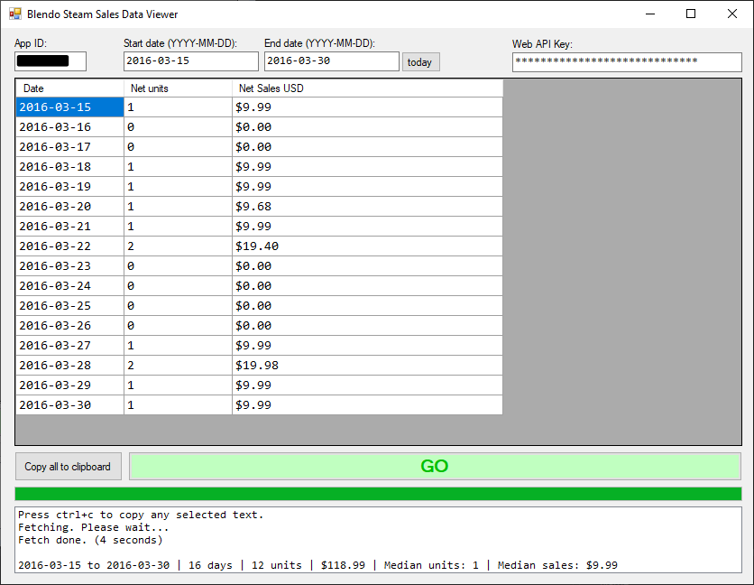

# Blendo Steam Sales Data Viewer

## About
This is a tool for viewing your Steam sales data.

Details about the Steam sales API here:
- https://steamcommunity.com/groups/steamworks/announcements/detail/532096678169150062
- https://partner.steamgames.com/doc/webapi/IPartnerFinancialsService

This tool shows net units and net sales. As described in the API documents above, there is a lot of sales information available, such as discount info, region info, bundle info, returns, etc. It should be relatively simple for you to make custom modifications to this tool for your specific needs.

This is written in C# and a .sln solution for Visual Studio 2015 is provided. Windows only.

Pre-compiled binaries [available here](https://github.com/blendogames/BlendoSteamSalesDataViewer/releases/tag/release).

## Note
The web API key is stored in:
`C:\Users\USERNAME\AppData\Local\blendosteamsalesdata`

This is a sensitive key. Use at your own risk!

## License
This source code is licensed under the MIT license.

## Credits
- by [Brendon Chung](https://blendogames.com)
- uses code from [SteamWebAPI2](https://github.com/babelshift/SteamWebAPI2)

## Libraries used
- [Json.NET 11.0.2](https://www.newtonsoft.com/json)
